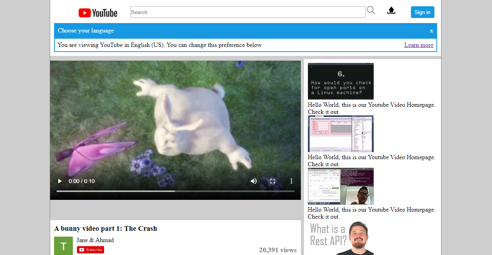

# Project: Embedding Images and Videos
This is a youtube video player page cloned using HTML and CSS.

This is a youtube video player homepage. It has as main sections, the navigation bar, a video, a sidebar containing images and their titles and a footer.

# Built with
<ul>
<li>HTML</li>
<li>CSS</li>
</ul>

# Authors
<ul>
<li>GitHub: @georjane</li>
<li>GitHub: @ahmadchata</li>
</ul>

# Show your support
Give a star if you like this project

# Acknowlegdements
<ul>
<li>Hat tip to Youtube</li>
<li>The Odin Project</li>
</ul>